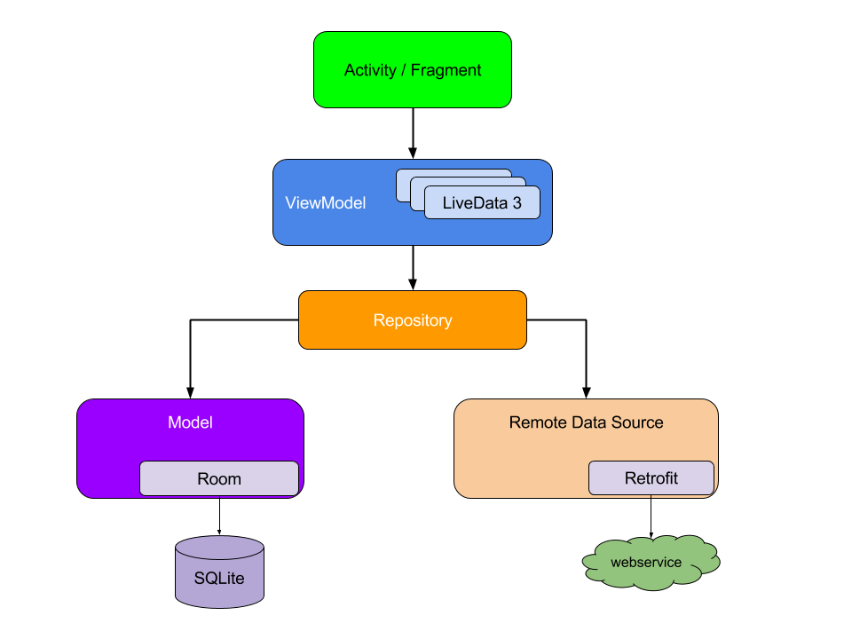
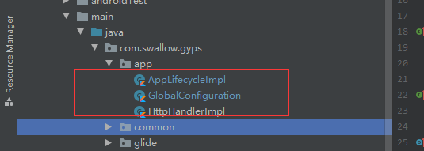

## Gyps  基于Google 最新AAC架构的移动端开发框架

>The MVVM architecture mobile development framework based on the Kotlin language.Contains Retrofit、Coroutine-Flow、Dagger-Hilt、ViewBinding、Glide、ROOM、ARouter And Other commonly used library of tools.

>全面支持androidX

[](https://github.com/hpuhsp/Gyps)
[ ](https://bintray.com/beijingwahaha/maven/Gyps/1.0.5/link)
//[ ](https://bintray.com/beijingwahaha/maven/Gyps/1.0.5/link)

### 主要技术实现

* Retrofit 网络请求
* 协程Coroutine及1.3.2发布后新增Flow库
* ViewBinding 视图绑定
* Dagger-Hilt 依赖注入
* Glide V4版本 （Generated API使用）
* Room 数据库
* ARouter 路由框架（1.0.3版本后已移除，根据需要自行引入）
* EventBus 事件处理
* immersionbar 状态栏定制
* easypermissions 权限处理
* ...


### 特点

* 网络可动态配置，支持域名动态切换、自定义拦截处理及日志打印策略。
* 支持组件化方案，模块化动态配置。
* 根据kotlin语言特性，提供多种扩展函数。
* （呃...暂时就列这么多吧）


### Usage
#### 1、接入方式

1、直接将swallow模块作为Module引入。

2、添加远程依赖

```
implementation 'com.fly:swallow:1.0.5'
```

#### 2、配置build.gradle文件

* 项目根目录下build.gradle下引入Dagger Hilt插件，gradle工具版本推荐4.0+

```
    dependencies {
        classpath "com.android.tools.build:gradle:4.0.1"
        classpath "org.jetbrains.kotlin:kotlin-gradle-plugin:$kotlin_version"
        // Dagger-Hilt
        classpath 'com.google.dagger:hilt-android-gradle-plugin:2.28-alpha'
    }
```

* app或Module下build.gradle文件配置：

```
plugins {
    id 'com.android.application'
    id 'kotlin-android'
    id 'kotlin-android-extensions'
    id 'kotlin-kapt'
    id 'dagger.hilt.android.plugin'
}
android {
    ...
    // ViewBinding
    buildFeatures {
        viewBinding = true
    }
}

dependencies {
    implementation fileTree(dir: "libs", include: ["*.jar"])
    //=========== Dagger Hilt 依赖注入 ============//
    implementation rootProject.ext.dependencies["hilt-android"]
    implementation rootProject.ext.dependencies["hilt-lifecycle-viewmodel"]
    kapt rootProject.ext.dependencies["hilt-android-compiler"]
    kapt rootProject.ext.dependencies["hilt-compiler"]
    // Glide
    kapt rootProject.ext.dependencies["glide-compiler"]
    ....
}

```

#### 3、Dagger Hilt依赖注入

* 程序入口处添加@HiltAndroidApp注解

```
@HiltAndroidApp
class MyApplication : BaseApplication() {
    override fun onCreate() {
        super.onCreate()
        // 可根据编译环境选择日志打印策略
        initLogger(true)
    }
}
```

并在项目AndroidManifest.xml中引入
```
  <application
        android:name=".MyApplication"
        ....>
```

#### 4、MVVM模式下进行开发


基于Dagger-Hilt依赖注入实现标准化、松耦合等特性MVVM架构下进行开发。如：Activity/Fragment 需要添加@AndroidEntryPoint注解。本地化存储及注入类全局初始化策略可以参考设备项目‘包名.app/’目录下具体实现类。功能页面开发构成方式可以参见Gyps项目主页健康上报功能实现方式。

#### 5、全局文件配置（可选）



* AppLifecycleImpl生命周期实现类

```
@Singleton
class AppLifecycleImpl : AppLifecycle {
    override fun attachBaseContext(base: Context) {

    }

    override fun onCreate(application: Application) {
        // Module下应用级初始化操作
        // initARouter()
    }

    /**
     * 退出APP
     */
    override fun onTerminate(application: Application) {
    }
}
```

* GlobalConfiguration 全局配置文件+AndroidManifest中注册

```
@Singleton
class GlobalConfiguration : ConfigModule {
    override fun applyOptions(context: Context?, builder: GlobalConfigModule.Builder) {
        // App域名、网络参数配置
        builder.baseurl(object : BaseUrl {
            override fun url(): HttpUrl? {
                return "http://www.github.com/".toHttpUrlOrNull()
            }
        })
        builder.globalHttpHandler(HttpHandlerImpl())
    }

    /**
     * 添加子Module的生命周期监听
     */
    override fun injectModulesLifecycle(context: Context, lifecycleList: ArrayList<AppLifecycle>) {
        lifecycleList.add(AppLifecycleImpl())
    }
}
```
```
// "包名"替换为项目实际包名
<meta-data
    android:name="{包名}.app.GlobalConfiguration"
    android:value="ConfigModule" />
```

* HttpHandlerImpl 网络请求参数配置及拦截处理

```
@Singleton
class HttpHandlerImpl : GlobalHttpHandler {

    override fun onHttpResultResponse(
        httpResult: String?,
        chain: Interceptor.Chain,
        response: Response
    ): Response {
        // 此处可以进行token校验并进行相关处理
        return response
    }

    override fun onHttpRequestBefore(chain: Interceptor.Chain, request: Request): Request {
        return chain.request().newBuilder()
            .header("Content-Type", "application/json;charset=UTF-8")
            .addHeader("platform", "Android")
            .addHeader("token","xxxxxxxxxxxxxxxxx")
            .addHeader("udid","231ddsad1421x2312sdmdsads22")
            .build()
    }

    /**
     * 动态切换域名访问
     */
    override fun redirectRequest(
        chain: Interceptor.Chain,
        request: Request,
        exception: Exception
    ): Response? {

        return null
    }
}
```

* Glide 扩展API

```
@GlideExtension
class MyGlideExtension private constructor() {
    companion object {
        private const val USER_AVATAR_SIZE = 168

        /**
         * 加载用户头像
         */
        @JvmStatic
        @GlideOption
        fun userAvatar(options: BaseRequestOptions<*>): BaseRequestOptions<*> {
            return options
                .centerCrop()
                .override(USER_AVATAR_SIZE)
        }
    }
}
```

